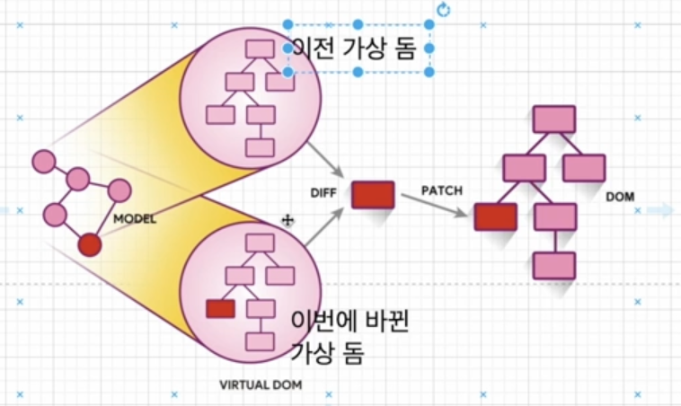

# FastCampus_FE

## React란 
- 프론트앤드 개발을 도와주는 라이브러리
- Vue.js, Angular은 라이브러리가 아닌 프레임워크
- MVC (Model, View, Controller) 중 View를 담당
- 가상 DOM 과 Component 기반 아키텍쳐

## Critical Render Path (CRP)


1. DOM tree 생성
  - 랜더 엔진이 문서를 읽어들여서 그것들을 파싱
  - 그리고 어떤 내용을 페이지에 랜더링할 지 결정한다.
2. Render tree 생성
  - 이 단계는 브라우저가 DOM과 CSSOM을 결합하는 곳이다.
  - 이 프로세스는 화면에 보이는 모든 콘텐츠와 스타일 정보를 모두 포함하는 최종 렌더링 트리를 출력한다.
  - `즉 화면에 표시되는 모든 노드의 콘텐츠 및 스타일 정보를 포함한다.`
3. Layout (reflow)
  - 브라우저가 페이지에 표시되는 각 요소의 크기와 위치를 계산하는 단계
4. Paint
  - 실제 화면에 그리는 단계

## 문제점
- 어떤 인터렉션에 의해 DOM에 변화가 발생하면 그떄마다 Render Tree가 재생성된다.
- 즉 모든 요소들의 스타일을 다시 계산하고 Layout, Paint과정까지 다시 거치게 된다.
- 작은 변화때문에 불필요한 과정을 계속 거치게 되니 너무 많은 비용 발생

## 해결방법 : Virtual Dom



- 데이터가 바뀌면 가상돔에 렌더링되고 이전에 생긴 가상돔과 비교해서 바뀐 부분만 실제 돔에 적용 시켜준다.
- 바뀐 부분을 찾는 과정을 `Diffing`이라고 부르며, 바뀐 부분만 실제 돔에 적용시켜주는 것을 `Reconciliation(재조정)` 이라고 부른다.


## 리액트 앱 설치 방법
- 요즘에는 `npx create-react-app <폴더 이름>`이라는 명령어로 간단하게 설치할 수 있다.

## 원래 리액트 앱 설치하는 방법
- Webpack 이나 Babel같은 모듈을 설치하고 설정해야 리액트 앱을 시작할 수 있었음.

## 웹팩이란
- 웹팩은 오픈소스 자바스크립트 모듈 번들로써 여러개로 나누어져 있는 파일들을 하나의 자바스크립트 코드로 압축하고 최적화하는 라이브러리

## 웹팩의 장점
1. 여러 파일의 자바스크립트 코드를 압축하여 최적화 할 수 있기 때문에 로딩에 대한 네트워크 비용을 줄일 수 있다.
2. 모듈 단위로 개발이 가능하여, 가독성과 유지보수가 쉽다.
 

## 바벨이란?
- 최신 자바스크립트 문법을 지언하지 않는 브라우저들을 위해서 최신 자바스크립트 문법을 구형 브라우저에서도 돌 수 있게 변환 시켜주는 라이브러리

> 이제는 Create-React-App을 사용해서 리액트를 설치합니다. 이렇게 하면 Babel이나 Webpack 설정이 이미 다 되어 있어 리액트 앱을 시작할 수 있는 시간이 줄어듭니다.

## 리액트 설치 순서
```zsh
mkdir react-tictactoe-app
npx create-react-app ./react-tictactoe-app/
```
- npx는 노드 패키지 실행을 도와주는 도구
- 그래서 create-react-app이란 npm 레지스트리에 있는 패키지를 react-tictactoe-app폴더에서 실행해서 리액트를 설치해 준다.
