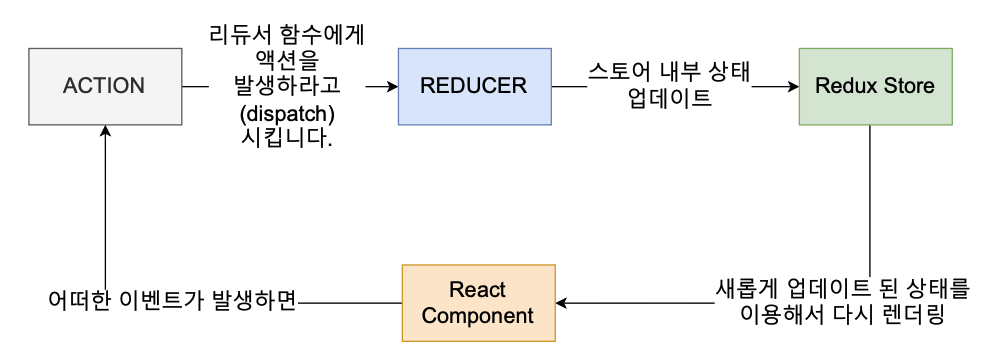
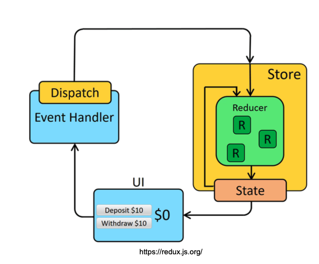

# 미들웨어 없이 리덕스 카운터 앱 만들기

## Redux 데이터 Flow



1. 리액트 앱 설치
```
npx create-react-app ./ --template typescript
```

2. 리덕스 라이브러리 설치
```
npm install redux --save
```

3. Counter UI 및 함수 생성
```typescript
import React from 'react';
import './App.css';

type Props = {
  value: number;
  onIncrement: () => void;
  onDecrement: () => void;
};

function App({value, onIncrement, onDecrement} : Props) {
  return (
    <div className='App'>
      Clicked: {value} times
      <button onClick={onIncrement}>
        +
      </button>
      <button onClick={onDecrement}>
        -
      </button>
    </div>
  );
}

export default App;

```

4. Reducer 생성
- src/reducers/counter.tsx 파일 생성
```typescript
const counter = (state = 0, action: {type: string}) => {
  switch (action.type) {
    case 'INCREMENT':
      return state + 1;
    case 'DECREMENT':
      return state - 1;
    default:
      return state;
  }
}

export default counter;
```

5. Store 생성 및 Action 전달
- CreateStore() : 앱의 전체 상태 트리를 보유하는 Redux 저장소를 만듭니다. 앱에는 하나의 스토어만 있어야 합니다.
- getState() : 애플리케이션의 현재 상태 트리를 반환합니다. 스토어의 리듀서가 반환한 마지막 값과 같습니다.
- subscribe() : change listener를 추가합니다. 작업이 전달될 때마다 호출되며 상태 트리의 일부가 잠재적으로 변경되었을 수 있습니다. 그런 다음 getState()를 호출하여 콜백 내부의 현재 상태 트리를 읽을 수 있습니다.
- src/index.tsx에 추가
```tsx
import React from 'react';
import ReactDOM from 'react-dom/client';
import './index.css';
import App from './App';
import reportWebVitals from './reportWebVitals';
import { createStore } from 'redux';
import counter from './reducers/counter';

const root = ReactDOM.createRoot(
  document.getElementById('root') as HTMLElement
);

const store = createStore(counter);

const render = () => root.render(
  <React.StrictMode>
    <App 
      value={store.getState()}
      onIncrement={() => store.dispatch({type: 'INCREMENT'})}
      onDecrement={() => store.dispatch({type: 'DECREMENT'})}
    /> 
  </React.StrictMode>
);
render();
store.subscribe(render);

// If you want to start measuring performance in your app, pass a function
// to log results (for example: reportWebVitals(console.log))
// or send to an analytics endpoint. Learn more: https://bit.ly/CRA-vitals
reportWebVitals();
```

6. combineReducer 생성
- rootReducer을 /src/reducers/index.tsx에 생성
```tsx
import { combineReducers } from "redux";
import counter from "./counter";
import todos from "./todos";

const rootReducer = combineReducers({
  counter,
  todos
})

export default rootReducer;
```

7. Provider
- `Privider란` : <Provider> 구성 요소는 Redux Store 저장소에 엑세스해야 하는 모든 중첩 구성 요소에서 Redux Store 저장소를 사용할 수 있도록 합니다.
- React Redux 앱의 모든 React 구성 요소는 저장소에 연결할 수 있으므로 대부분의 응용 프로그램은 전체 앱의 구성 요소 트리가 내부에 있는 최상위 수준에서 <Provider>를 렌더링 합니다.
- 그런 다음 Hooks 및 연결 API는 React의 컨텍스트 메커니즘을 통해 제공된 저장소 인스턴스에 엑세스할 수 있습니다.
```
npm install react-redux --save 
```

```tsx
import React from 'react';
import ReactDOM from 'react-dom/client';
import './index.css';
import App from './App';
import reportWebVitals from './reportWebVitals';
import { createStore } from 'redux';
import rootReducer from './reducers/index';
import { Provider } from'react-redux';

const root = ReactDOM.createRoot(
  document.getElementById('root') as HTMLElement
);

const store = createStore(rootReducer);

//todos reducer 확인
store.dispatch({type: 'ADD_TODO', text: 'todo1'});

console.log('store.getState',store.getState());

const render = () => root.render(
  <React.StrictMode>
    <Provider store={store}>
      <App 
        value={store.getState()}
        onIncrement={() => store.dispatch({type: 'INCREMENT'})}
        onDecrement={() => store.dispatch({type: 'DECREMENT'})}
      /> 
    </Provider>
  </React.StrictMode>
);
render();
store.subscribe(render);

// If you want to start measuring performance in your app, pass a function
// to log results (for example: reportWebVitals(console.log))
// or send to an analytics endpoint. Learn more: https://bit.ly/CRA-vitals
reportWebVitals();

```